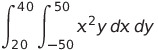

<!--
 Copyright (c) 2021 Himanshu Goel
 
 This software is released under the MIT License.
 https://opensource.org/licenses/MIT
-->

# C++11 Multithreading Example

Computes:



Uses rectangular integration/midpoint rule for the calculation.

## Compilation Flags
Comment out:
```cpp
#define MULTITHREADED
```
to switch to single threaded mode.

## Compilation
### On Windows:
Open ThreadingExample.vcxproj and run as any other C++ project. No compilation flags involved.

### On Linux:
Use the following command:

```bash
g++ -std=c++11 -pthread main.cpp -o ThreadingExample
```

to compile the example into a 'ThreadingExample' executable. Run using:

```bash
./ThreadingExample
```

## Example Output

Single threaded:
```bash
Solving integral  x*x*y for x=[-50.000000, 50.000000] y=[20.000000, 40.000000]
Single threaded mode.
Numerical Integral:  49999999.499997
Analytical Integral: 50000000.000000

y_counter_atomic = 10000
y_counter_nonatomic = 10000
Success!
```

Multithreaded:
```bash
Solving integral  x*x*y for x=[-50.000000, 50.000000] y=[20.000000, 40.000000]
Using 8 threads.
Numerical Integral:  49999999.500002
Analytical Integral: 50000000.000000

y_counter_atomic = 10000
y_counter_nonatomic = 9941
Success!
```

## Notes
* y_counter_nonatomic will be essentially random in the multithreaded version due to thread racing
* Expect minor variation in the numerical integral calculation between the two versions due to differing order of operations and other floating point issues.